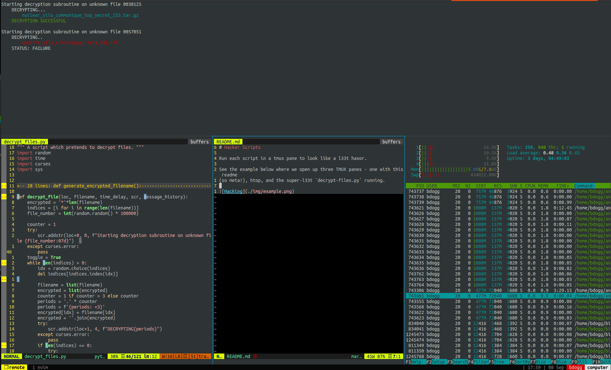

# Hacker Scripts

Run each script in a tmux pane to look like a l33t haxor.

See the example below where we open up three TMUX panes - one with this readme
(so meta!), htop, and the super-l33t `decrypt-files.py` running.

